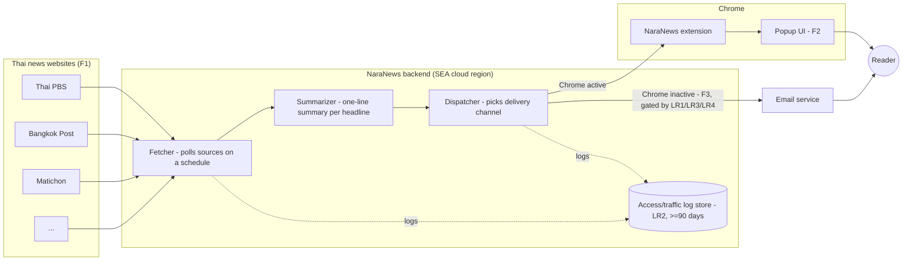

# Diagram 1 — System Context / Architecture

Every backend entry point (fetch trigger, dispatch trigger) writes to the LR2 access log. F3's email path is
gated on LR1 (purpose-limited use), LR3 (verified identity), and LR4 (recorded consent) — shown as annotations
here rather than separate boxes to keep the diagram at system-context level.
