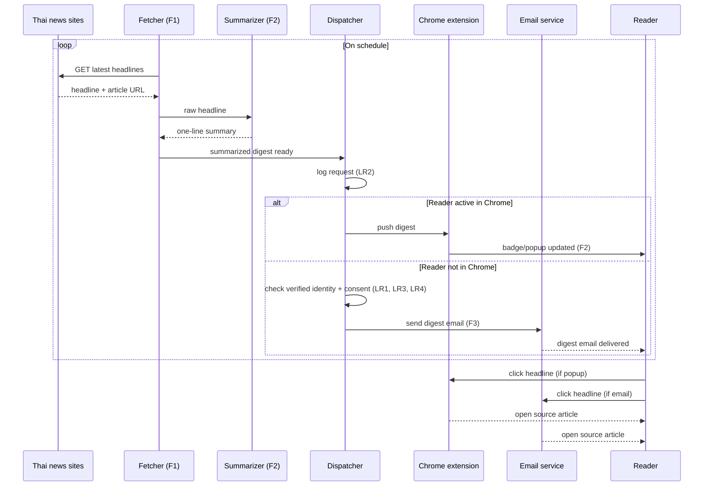

# Diagram 2 — Sequence: Fetch → Summarize → Deliver

```mermaid
sequenceDiagram
    participant Src as Thai news sites
    participant F as Fetcher (F1)
    participant Sum as Summarizer (F2)
    participant D as Dispatcher
    participant Ext as Chrome extension
    participant Mail as Email service
    participant R as Reader

    loop On schedule
        F->>Src: GET latest headlines
        Src-->>F: headline + article URL
        F->>Sum: raw headline
        Sum-->>F: one-line summary
        F->>D: summarized digest ready
        D->>D: log request (LR2)
        alt Reader active in Chrome
            D->>Ext: push digest
            Ext->>R: badge/popup updated (F2)
        else Reader not in Chrome
            D->>D: check verified identity + consent (LR1, LR3, LR4)
            D->>Mail: send digest email (F3)
            Mail-->>R: digest email delivered
        end
    end
    R->>Ext: click headline (if popup)
    R->>Mail: click headline (if email)
    Ext-->>R: open source article
    Mail-->>R: open source article
```
