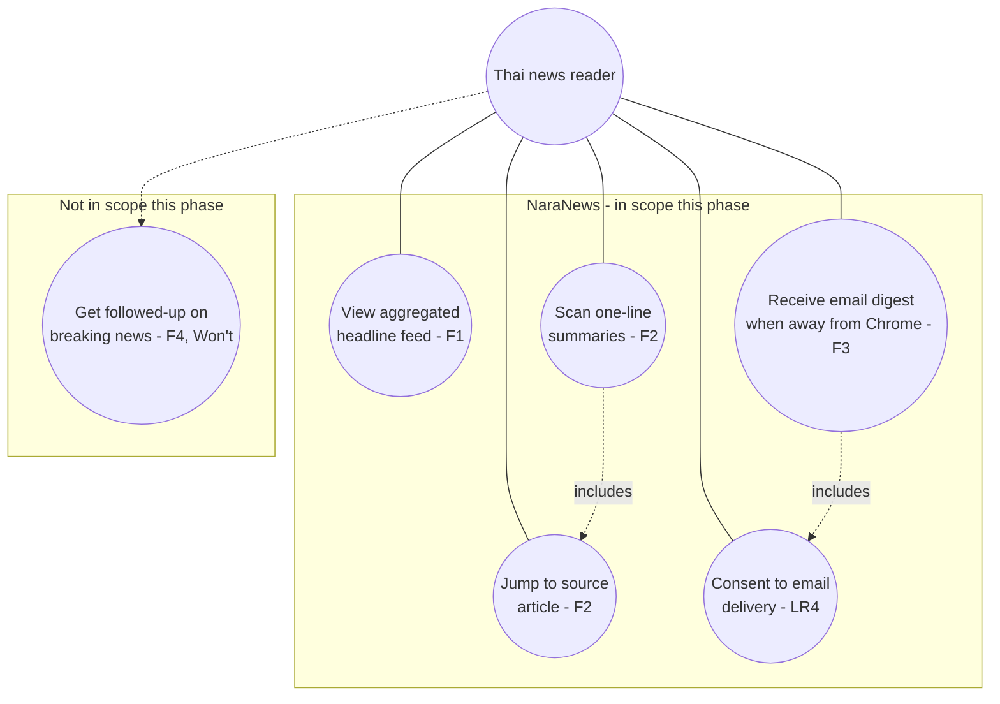

# Diagram 3 — Use Case

UC5 (consent) is drawn as `includes` on UC4 because F3 cannot legally fire for a reader until LR1/LR3/LR4 are
satisfied — consent isn't a separate feature the reader seeks out, it's a precondition of the email use case.
