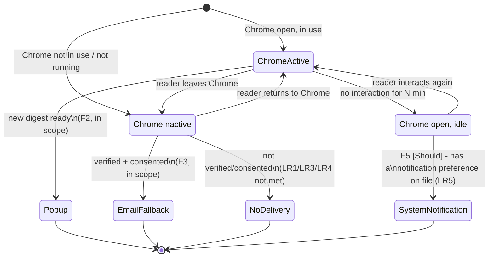

# Diagram 4 — State: Which Channel Does a Reader Get?

The `ChromeIdle` → `SystemNotification` transition is now backed by F5 [Should], sourced to survey data: P4 found
readers evenly split (3/7 Chrome notification, 3/7 email digest, 1/7 neither) on how they want to be notified when
idle. This is survey-supported, not yet interview-validated — see
[01-spec/20260902-01-news-digest.md](../../01-requirements/01-spec/20260902-01-news-digest.md) for the full
citation and [00-proposal.md](../00-proposal.md) for status.
