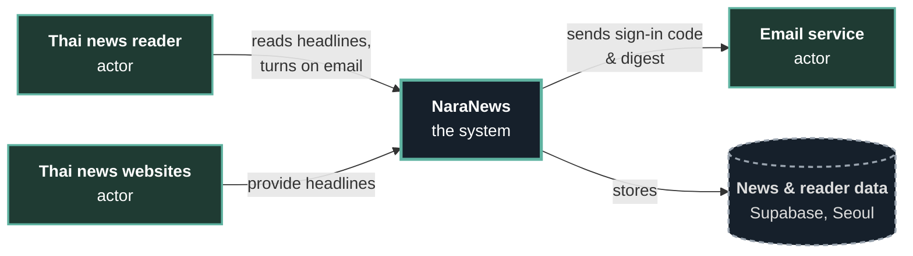

# D1 — System Context: NaraNews (month-2 scope)

NaraNews is drawn as one box, with everyone and everything outside it that talks to it and the place its data is stored. Names follow [the spec](../../01-requirements/01-spec/20260902-01-news-digest.md).

**Legend:**
- **Green boxes:** external actors. "Thai news reader" and "Thai news websites" are the spec's own names. "Email service" is the outside service that F3's "by email" delivery goes through; the code uses Resend for it.
- **Bold box:** NaraNews, the system. It is one box with no inside detail.
- **Dashed cylinder:** where the data is stored.
- **Arrows:** what flows between them.

**Scope:**
- **In (inside the NaraNews box):** F1 aggregate headlines, F2 one-line clickable list, F3 email digest when away.
- **Out (not built in month 2):** F4 breaking-news follow-up and F5 Chrome notification when idle ([feature-list.md](../feature-list.md)).

**Stored data:** headlines with source links, the reader's verified email, the consent record, and the access log (kept for at least 90 days). The data is held in Seoul, which is a cross-border transfer, so it must be listed in the privacy notice (rule.md, PDPA).
