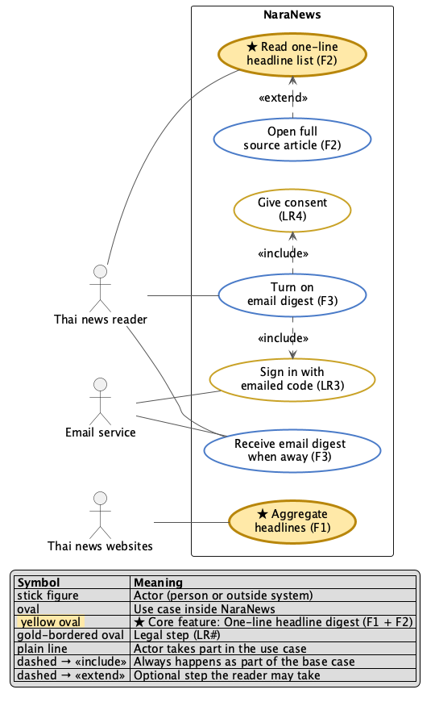

# D2 — Use Case: NaraNews (month-2 scope)

This diagram shows who can do what. Actor names match [D1](D1-system-context.md). "Thai news reader" and "Thai news websites" come from [the spec](../../01-requirements/01-spec/20260902-01-news-digest.md), and "Email service" is F3's "by email" channel (Resend), and the scope is F1–F3 plus LR3 and LR4. LR1 is a rule about how the email is stored, not something a user does, so it appears in [D3](D3-architecture.md).

Source: [D2-use-case.puml](D2-use-case.puml) (PlantUML; attach this in the appendix).

**Legend:**
The legend is drawn inside the diagram. It uses standard UML notation: stick figure = actor, oval = use case, plain line = actor takes part, dashed open arrow = «include» or «extend». The yellow oval is the core use case, and gold-bordered ovals are legal steps.

**Why each include or extend is real:**
- **Turn on email digest «include» Sign in:** the backend refuses to send the digest unless the reader's email is verified (LR3, `/api/dispatch/email`).
- **Turn on email digest «include» Give consent:** consent is recorded in `consent_log` before F3 can fire (LR4).
- **Open full source article «extend» Read one-line list:** this step is optional. Readers tap only the headlines that interest them (P3).

**Not drawn:** access logging (LR2) runs inside the system and has no actor, so it isn't a use case. F4 and F5 are out of scope ([feature-list.md](../feature-list.md)).
