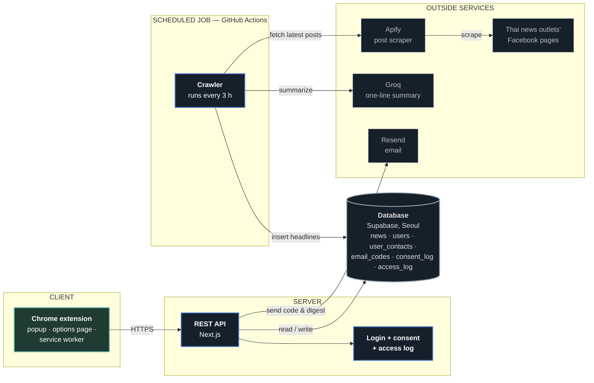

# D3 — High-Level Architecture: NaraNews (month-2 scope)

This diagram shows the parts inside NaraNews and which way data moves. Boxes are parts, and an arrow means "who calls whom". It matches the tech stack in [README.md](README.md#tech-stack-what-d3-must-match).

**Legend:**
- **Green box:** client, the part the reader uses.
- **Blue boxes:** parts that we run. The REST API runs on the server, and the Crawler runs as a scheduled GitHub Actions job.
- **Cylinder:** the database.
- **Dashed boxes:** outside services we call but don't own.
- **Arrow A → B:** A calls B or sends data to B.

**rule.md duties shown in the diagram:**
- **`access_log`:** required by CCA §26, LR2. Every API request is logged and kept for at least 90 days.
- **`consent_log`:** required by ETA §9/26/28, LR4. No email is sent without a consent record.
- **`user_contacts`:** required by PDPA, LR1. The email address is stored for one purpose only, sending the digest, and is never reused for marketing.
- **Login by emailed code:** LR3. No email is sent to an address that hasn't been verified.

**Data direction:**
- **Headlines:** the Crawler asks Apify to scrape the latest posts from Thai news outlets' Facebook pages, has Groq write a one-line summary, and inserts the result into the database. D1 and D2 call this source "Thai news websites", the spec's name. Whether the spec should say Facebook pages instead is still an open decision.
- **Reading:** the Chrome extension calls the REST API, which reads the headlines from the database.
- **Email:** when the reader is away, the REST API sends the digest through Resend.
