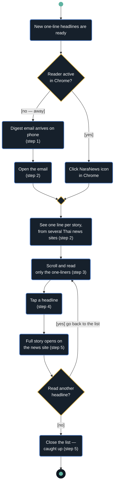

# D4 — Activity: Catch up on today's Thai news (month-2 scope)

This diagram follows one scenario from start to end. Its steps match [user-journey.md](../user-journey.md) in the same order, and it covers F1, F2 and F3. The decision is the real F2/F3 branch: if the reader is in Chrome they get the popup, and if they're away they get the email.

**Legend:**
- **● (filled circle):** start.
- **◉ (circle with a ring):** end.
- **Rounded box:** an action.
- **◆ (gold diamond with a question):** a decision.
- **◆ (empty gold diamond):** a merge, where the branches join again.
- **[brackets]:** a guard, the condition for taking that branch.

**Precondition:** the reader has already signed in with the emailed code (LR3) and agreed to the Terms and Privacy Policy (LR4). Without both, the [no — away] branch sends nothing.
