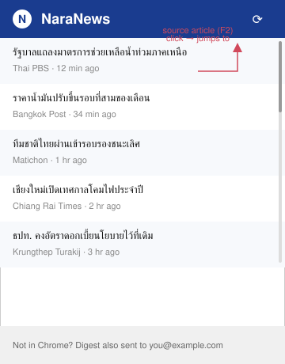

# NaraNews — Prototype (W5 Design Draft)

Low-fidelity wireframe of the popup, covering F1 (aggregated feed), F2 (one-line clickable summaries), and the
"not in Chrome" fallback footer that hands off to F3 (email digest).

## Walkthrough
1. Reader clicks the NaraNews toolbar icon (badge shows an unread count once F1 has fetched new headlines).
2. Popup opens: a scrollable list of one-line, source-attributed, timestamped headlines (F2). Alternating row
   shading + a scrollbar hint signal there's more to scroll.
3. Clicking any row jumps straight to that headline's full article on the source site (F2).
4. A footer line reminds the reader that when they're not in Chrome, the same digest also reaches them by email
   (F3) — this is the visual hook for LR1/LR4 (the reader needs to have given consent + a verified email for that
   line to be true for them).

## Not yet prototyped
No screen exists yet for a "Chrome system notification" state — see the open gap in
[feature-list.md](feature-list.md) and [00-proposal.md](../00-proposal.md). The team's own survey (Nara News —
News Habits & Preferences Survey) already asks respondents about exactly this, so resolve it from real answers
before wireframing a third delivery surface.

## Next iteration
Replace this static wireframe with a clickable prototype (Figma/plain HTML) once real interview/survey data
confirms the popup layout matches what readers actually scan for (e.g., do they want the source name, or just the
headline + time?).
