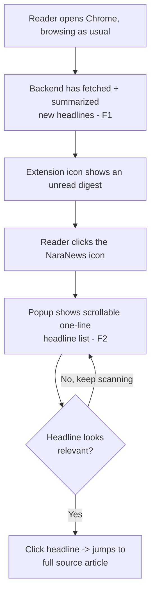
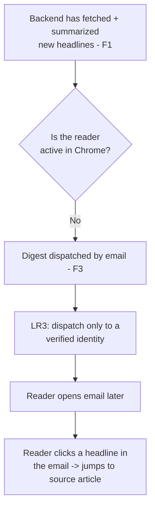
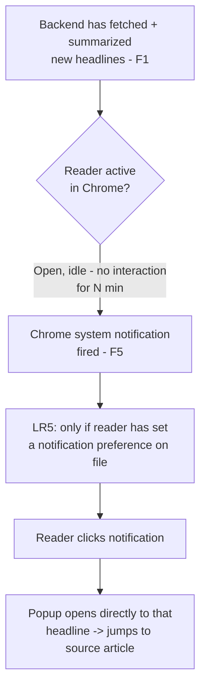

# NaraNews — User Journey (W5 Design Draft)

Three journeys for the same reader, branching on Chrome state. All start from the same backend fetch cycle (F1)
and share the same summarized digest content (F2); only the delivery channel differs.

## Journey A — Reader is actively using Chrome

## Journey B — Reader is not currently in Chrome

## Journey C — Reader has Chrome open but is idle [F5, Should]

## Notes
- All three journeys converge at "click headline -> source article" — the actual reading experience is identical,
  only the notice mechanism differs.
- LR1/LR4 (purpose-limited use + recorded consent for the email address) gate whether Journey B is even reachable
  for a given reader: no verified, consented email on file → that reader can only ever experience Journey A (and,
  once built, Journey C).
- Journey C is sourced to survey data (P4: 3/7 want Chrome notification when idle, 3/7 want email, 1/7 want
  neither) — see [00-proposal.md](../00-proposal.md). It's Should, not Must, and survey-supported rather than
  interview-validated — treat this journey as provisional until the required live interviews confirm it.
